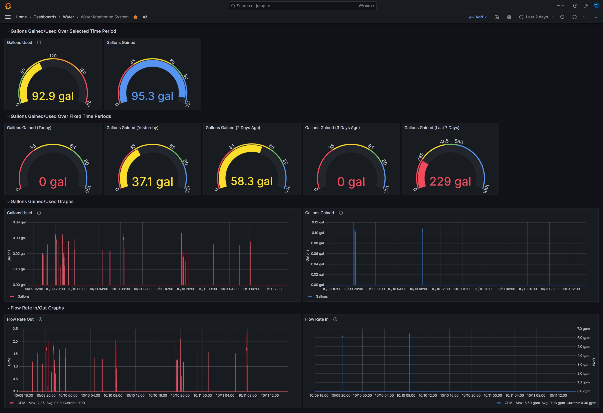
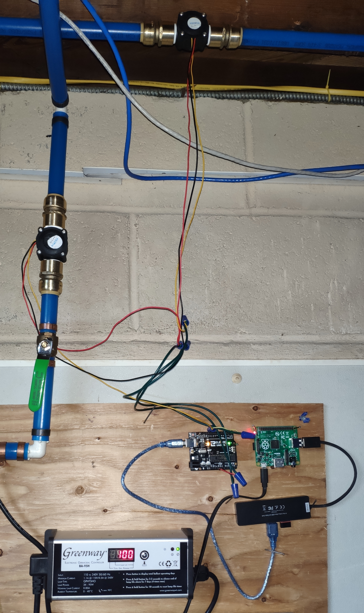
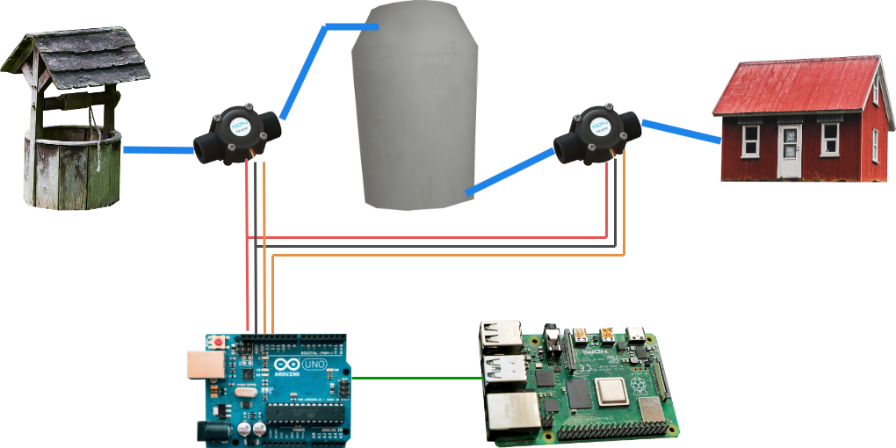

# Water Monitoring System

A custom solution to monitor water consumption and well pump output. Output water usage data to an InfluxDB database and displayed using Grafana.  

## System Overview
This diagram shows the hardware layout of the system. Two flow sensors are used because we have a low output well, and therefore have a water storage tank to compensate for it frequently running dry.

Water from the well pump is sent through the first flow sensor on route to the water tank. Water is then pumped out of the tank, through the second flow sensor, and then on to the rest of the house. Each sensor is connected to the Arduino for 5v power, ground, and one interruptable digital data pin each. The Arduino is connected via USB to the Pi for power and serial communications. The Pi is powered by a USB power brick (not shown).

## Hardware Info

Hardware resources required:
1. Raspberry Pi
2. Arduino
3. Water flow sensor(s)

Which Pi and Arduino used isn't particularly important. The Pi must have a USB port to connect to the Arduino. I used a Pi Model A+ because it was the one I had, not because it was a great choice (had to use a USB hub and Wi-Fi adapter). Same with the Arduino, it just needs to have an interrupt pin per water sensor used (my setup uses 2 sensors). This Arduino (Elegoo Uno R3) is also probably overkill.

The water flow sensor I used is an [H2OPro HA-1045 Hall Effect Sensor](https://www.amazon.com/gp/product/B079HFY2TY). The main thing to look for is that it matches your pipes (size, threads, etc.) and can run on 5v (this one is 4-18v). You'll want to confirm the pulse frequency (1380 pulses/gallon for this one, edit the Arduino code if yours doesn't match that) as well. 

## Software Info
You'll want to set up an InfluxDB and a Grafana installation somewhere. See the documentation of each service for additional information. All this system needs is a database and a user account on InfluxDB. 

The code in the `arduino` folder should be written to the Arduino using the standard Arduino GUI / CLI tools. Check out [the arduino documentation](https://support.arduino.cc/hc/en-us/articles/4733418441116-Upload-a-sketch-in-Arduino-IDE) for a guide if needed. You may want to edit the code if your setup varies, such as having more/less than 2 flow sensors, or flow sensors with different pulse specifications. 

The Pi can be set up using the OS of your choice, such as the standard [Raspberry Pi OS](https://www.raspberrypi.com/software/). As long as it can run Python 3, any OS will probably work just fine. Copy the code in the `python` folder somewhere, such as the `pi` user's home directory. You'll want to copy the `config.example.yaml` to `config.yaml`, then edit it to match your environment. You also need to install the required packages using `pip install -r requirements.txt`. Afterward, you can use Python 3 to run the script, such as via `python main.py`. Alternatively, copy the `water-monitoring-system.service` file to `/etc/systemd/system/` to set up a systemd service to automatically run the script on startup. You probably also need to run `sudo systemctl enable water-monitoring-system` to enable it.

In your Grafana web interface, upload the dashboard code in `grafana/Water Monitoring System.json` and adjust as needed to configure your database connection. 

Feel free to open an issue if you have any questions or if something isn't working right!

